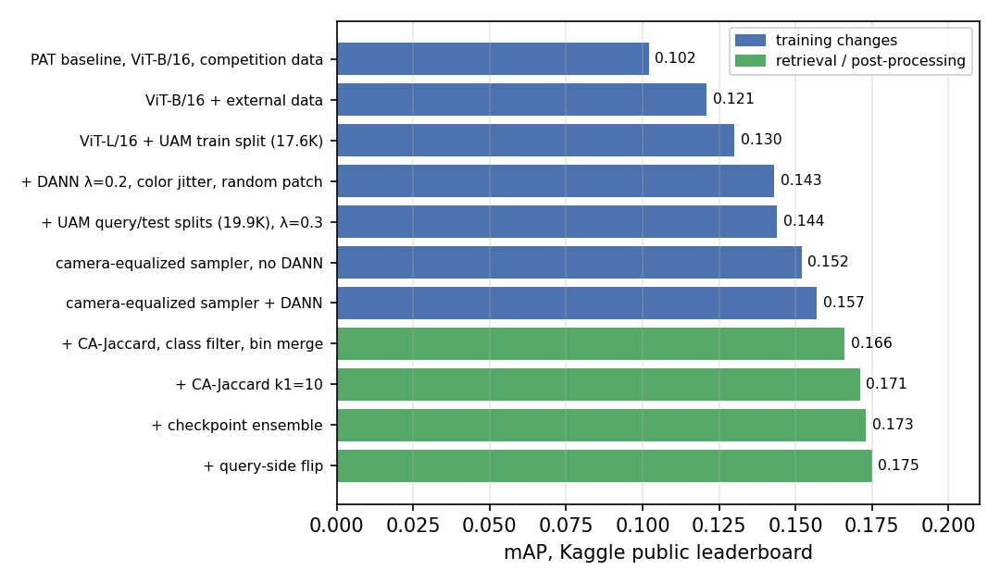
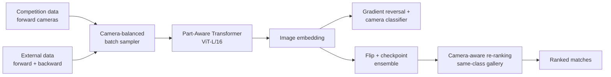

# Cross-View Urban Object Re-Identification

  

Finding the same street object (traffic sign, bin, container, crosswalk) in images taken while driving the route in the **opposite direction**, using a Vision Transformer, domain-adversarial training and a camera-balanced batch sampler.

Entry to the **Urban Elements ReID Challenge 2026**, an ICIP 2026 Grand Challenge hosted on Kaggle. Team: Biswarup Mukherjee and Sofia Acosta, Erasmus Mundus IPCV master's programme, Universidad Autónoma de Madrid. A two-page paper describing the method was submitted to the ICIP 2026 Grand Challenge track.

## Highlights

- **+72% mAP** over the Part-Aware Transformer baseline (0.102 → 0.175), **5th on the public leaderboard**.
- **Camera-balanced batch sampler**: 33% more cross-view training pairs per batch, +0.013 mAP in a controlled ablation.
- **Retrieval pipeline**: camera-aware re-ranking, class-restricted search, checkpoint ensembling and test-time flipping, +0.018 mAP on top of the best model.
- 24 tracked experiments, all trained on a single 11 GB GPU (RTX 2080 Ti).



---

## Objective

A city route was filmed several times. Three cameras drove it forwards, a fourth drove it backwards. Given a photo from the backward camera, the system ranks the forward-camera photos so that the same physical object comes first. From behind, a traffic sign is often a plain metal plate and a container shows its other side, so the query and its match can look very different.

The same pattern shows up in infrastructure inventories, map updates and repeated aerial or satellite passes: the object stays the same while the viewpoint changes.

| Split | Images | Identities | Cameras |
|---|---|---|---|
| Train (competition) | 11,175 | 1,088 | c001, c002, c003 (forward) |
| Query | 928 | hidden | c004 (backward) |
| Gallery | 2,844 | hidden | c001, c002, c003 (forward) |
| External set (UAM_Unified, organiser-provided) | 8,695 | 691 | c001 to c004 |

The competition training set has no backward-view images. The external set supplies 1,262 of them (322 identities), which is 6.4% of the merged 19,870-image training set.

Metric: mean average precision (mAP) on Kaggle. The public leaderboard uses 49% of the test set.

---

## Method



| Component | Details |
|---|---|
| Backbone | Part-Aware Transformer (PAT, ICCV 2023) with ViT-L/16, input 256×128 |
| Losses | identity classification with label smoothing, triplet loss, PAT part-consistency loss |
| Domain-adversarial branch | 3-layer MLP (1024-512-256-4) predicts the camera through a gradient reversal layer; weight ramps from 0 to 0.3 during training |
| Sampler | 8 identities × 4 images per batch; every group from an identity with backward-view images holds 1 backward + 3 forward images |
| Training | SGD, lr 0.008, 60 epochs, mixed precision, about 5.5 h per run |
| Retrieval | query features averaged with their horizontal flip, features averaged over checkpoints (epochs 45 to 60), gallery restricted to the query's class, CA-Jaccard re-ranking (CVPR 2024) |

---

## Results

### Training

| Configuration | Training images | mAP |
|---|---|---|
| PAT baseline, ViT-B/16 | 11.2K | 0.102 |
| + external data | | 0.121 |
| ViT-L/16 + external training split | 17.6K | 0.130 |
| + domain-adversarial training, colour jitter, random patch | 17.6K | 0.143 |
| + all external splits, adversarial weight 0.3 | 19.9K | 0.144 |
| Camera-balanced sampler, no adversarial branch | 19.9K | 0.152 |
| **Camera-balanced sampler + adversarial branch** | 19.9K | **0.157** |

### Camera-balanced sampler

PAT's default sampler draws 4 random images per identity, so backward-view images tend to clump into a few groups. The camera-balanced sampler spreads them out: each group gets exactly one backward image and three forward images of the same object. The number of backward images the model sees stays the same; what changes is how often a backward image is paired with a forward image of the same object inside a batch, which is exactly what the triplet loss learns from.

Measured with `tools/sampler_stats.py` on the real training lists (20 simulated epochs, no images loaded):

| Per batch of 32 images | Default sampler | Camera-balanced |
|---|---|---|
| Backward-view images | 2.00 | 2.04 |
| Cross-view positive pairs | 4.33 | **5.78 (+33%)** |
| Batches without any cross-view pair | 25.3% | **13.6%** |

Ablation on identical data, schedule and augmentation:

| Sampler | Adversarial branch | mAP |
|---|---|---|
| default | on | 0.144 |
| camera-balanced | off | 0.152 |
| camera-balanced | on | **0.157** |

The adversarial branch keeps camera identity out of the embedding: a camera classifier trained on the features reaches about 0.90 accuracy without it and 0.69 with it (chance is 0.25).

### Retrieval

| Step (on the best model) | mAP |
|---|---|
| Standard k-reciprocal re-ranking | 0.157 |
| Camera-aware Jaccard re-ranking + same-class gallery | 0.166 |
| Tighter re-ranking neighbourhood (k1 = 10) | 0.171 |
| Checkpoint ensemble | 0.173 |
| Query-side horizontal flip | **0.175** |

---

## What we learned

- **Data coverage mattered most.** The largest single gain came from adding the only labelled backward-view images, before any modelling changes.
- **How examples are paired can matter as much as how many there are.** The sampler shows the model the same number of backward-view images and still adds +0.013 mAP by pairing them better.
- **More invariance is not automatically better retrieval.** Forcing four backward-view identities into every batch made the features even less camera-specific (camera accuracy 0.60) but lowered mAP from 0.166 to 0.153, because those identities all come from the external campus data and pushed the batches away from the city domain being tested. Invariance and domain balance have to be tuned together.


The main pieces written for this project are in `exp17_dann_equalized/`: `sampler_exp17.py` (camera-balanced sampler), `dann_components.py` (gradient reversal and camera classifier) and `processor_exp17.py` (training loop).

---

## Running the code

### Environment

```bash
conda create -n ue-reid python=3.10 -y
conda activate ue-reid
pip install torch==2.1.0 torchvision==0.16.0 --index-url https://download.pytorch.org/whl/cu121
pip install -r requirements.txt
```

### Data

Datasets are not included in this repository.

- Competition data: [Kaggle competition page](https://www.kaggle.com/competitions/urban-elements-re-id-challenge-2026)
- External set (UAM_Unified): provided to participants by the organisers, see the [challenge website](http://www-vpu.eps.uam.es/challenges/UrbanReIDChallenge2026/)

Local paths are set in the experiment configs (`DATASETS.ROOT_DIR`, `MODEL.PRETRAIN_PATH`, `TEST.WEIGHT`), in `UAM_ROOT` inside `pat/data/datasets/UAM_Unified.py`, and in the CSV paths at the top of `pat/caj_filter_rerank.py`.

### Training

```bash
python experiments/exp17_dann_equalized/train_exp17.py \
    --config_file "$PWD/experiments/exp17_dann_equalized/config/train.yml"
```

Checkpoints are written every 5 epochs.

### Inference and submission

```bash
cd pat

# features for one checkpoint (TEST.WEIGHT in test.yml), with query flip
python update_tta.py --config_file ../exp17_dann_equalized/config/test.yml \
    --track track_exp17_ep60.txt
mkdir -p features && mv qf.npy features/qf_ep60.npy && mv gf.npy features/gf_ep60.npy
# repeat for epochs 45, 50 and 55

python ensemble_features.py \
    --qf features/qf_ep45.npy features/qf_ep50.npy features/qf_ep55.npy features/qf_ep60.npy \
    --gf features/gf_ep45.npy features/gf_ep50.npy features/gf_ep55.npy features/gf_ep60.npy \
    --out features/ens

python caj_filter_rerank.py --qf features/ens_qf.npy --gf features/ens_gf.npy \
    --merge_bins --k1 10 --k1_intra 10 --k1_inter 10 --k2 4 \
    --output submission_exp17.csv
```

### Sampler statistics

```bash
python tools/sampler_stats.py --pat-root pat \
    --competition-root /path/to/Urban2026 --uam-root /path/to/UAM_Unified
```

---

## References

- H. Ni, Y. Li, L. Gao, H. T. Shen, J. Song. *Part-Aware Transformer for Generalizable Person Re-identification.* ICCV 2023. [Code](https://github.com/liyuke65535/Part-Aware-Transformer)
- Y. Ganin, V. Lempitsky. *Unsupervised Domain Adaptation by Backpropagation.* ICML 2015.
- Y. Chen, Z. Fan, Z. Chen, Y. Zhu. *CA-Jaccard: Camera-aware Jaccard Distance for Person Re-identification.* CVPR 2024.
- Z. Zhong, L. Zheng, D. Cao, S. Li. *Re-ranking Person Re-identification with k-reciprocal Encoding.* CVPR 2017.
- Urban Elements ReID Challenge 2026, VPULab, Universidad Autónoma de Madrid. [Baseline code](https://github.com/vpulab/Urban-Elements-ReID---baseline)

Code under `pat/` comes from the PAT and challenge-baseline repositories and keeps their original terms.
